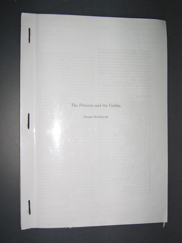
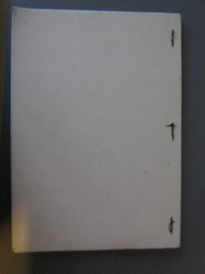
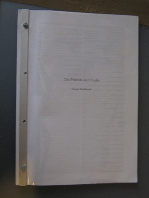
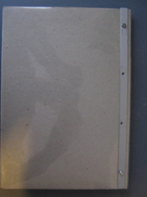

Title: Rilegatura di libri
Date: 2013-04-07
Tags: diy
Lang: it

Ci sono molti modi di rilegare singoli fogli per formare un piccolo libro

<figure>
  <figcaption>con filo, fronte</figcaption>
  
</figure>
<figure>
  <figcaption>con filo, retro</figcaption>
  
</figure>
  <figure>
  <figcaption>con bullone, fronte</figcaption>
  
</figure>
  <figure>
  <figcaption>con bullone, retro</figcaption>
  
</figure>

Scegliendo il metodo con bullone, si possono fare i buchi con un trapano, mentre per il metodo con filo è meglio usare un punteruolo a mano.
Il metodo con filo ha prodotto un libro più facile da usare.

  <h3>Nota</h3>

Many old works of literature like these are public domain. You can <strong>lawfully</strong> download them from
<a href="http://www.gutenberg.org/">Project Gutemberg</a> which I thanks very much because I enjoyed the novels.

Il metodo di rilegatura l'ho imparato su questi due siti:
 <a href="http://www.franuvolo.it/sito/idee/85-come-rilegare-un-libro.html">Fra Nuvolo</a> ed
<a href="http://www.elektrosoft.it/tutorials/rilegare-fotocopie/tecniche-rilegare-fotocopie.htm">Elektrosoft</a>
 

